

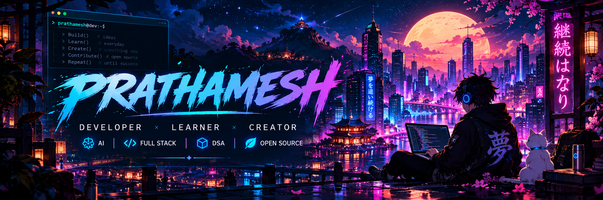

 

<table>
<tr>
<td width="27%" valign="top">

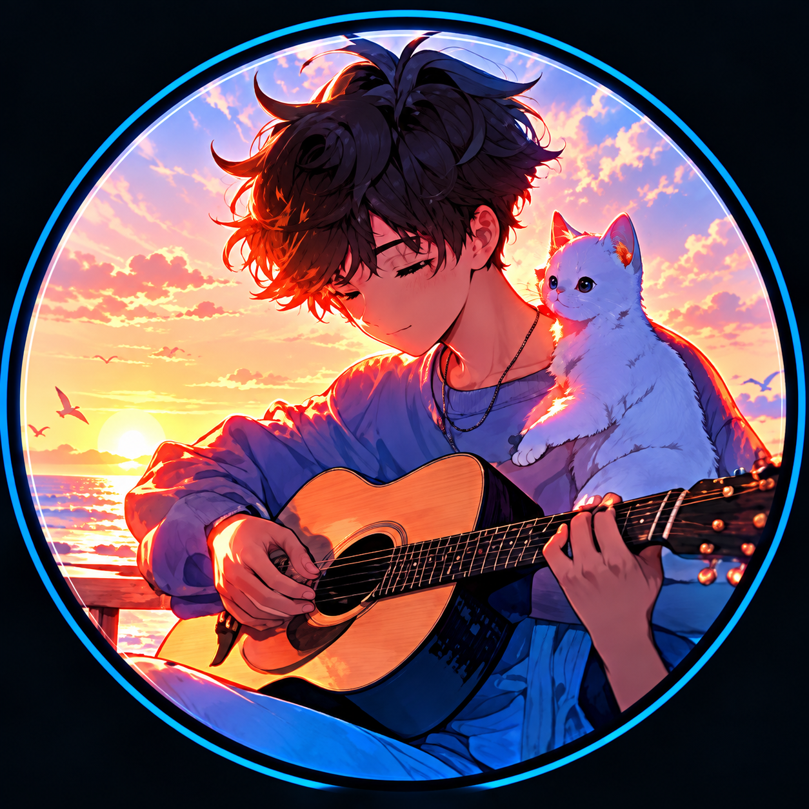

# PRATHAMESH

**SoundwaveSys · Developer**

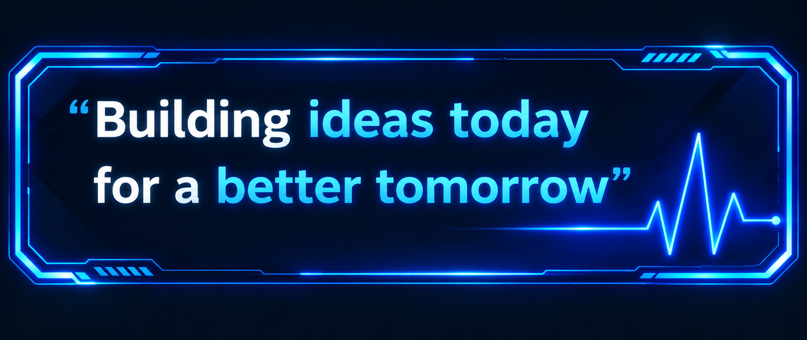

 

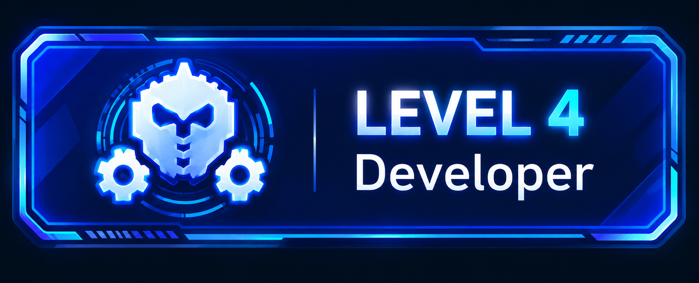

### 👨‍💻 About Me

Computer Engineering student passionate about:

- 🤖 AI & Machine Learning
- 💻 Full-Stack Development
- 🧠 Data Structures & Algorithms
- 👋 Open Source
- 🛠️ Building real-world projects

### 🎯 Current Quest

**Build → Learn → Create → Contribute**

### 🔗 GitHub

</td>

<td width="73%" valign="top">

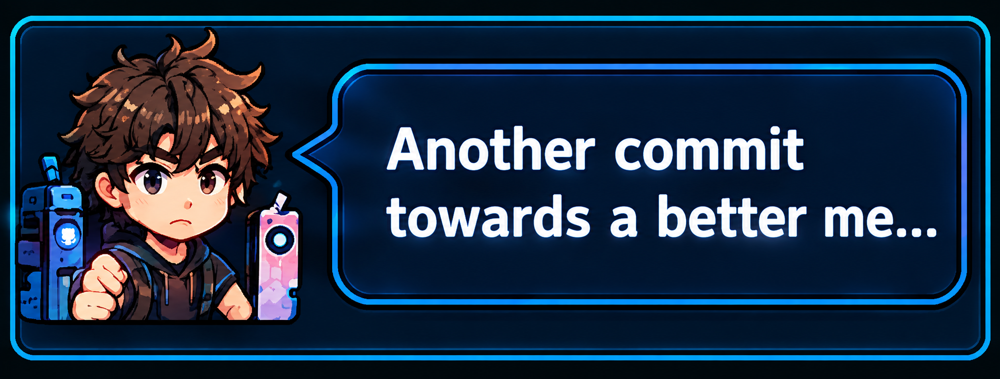

  

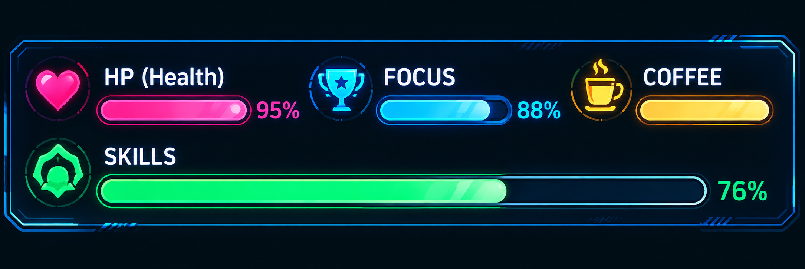

## 👤 About Me

I'm a Computer Engineering student who enjoys turning ideas into working software.  
I'm currently exploring AI, full-stack development, DSA, computer vision, and open-source contribution.

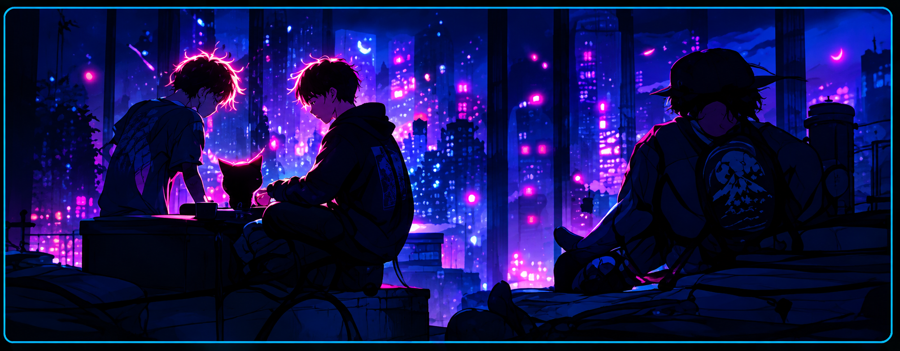
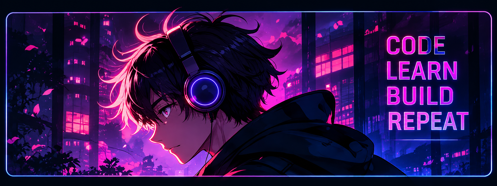

</td>
</tr>
</table>

 

## ⚙️ TECH STACK

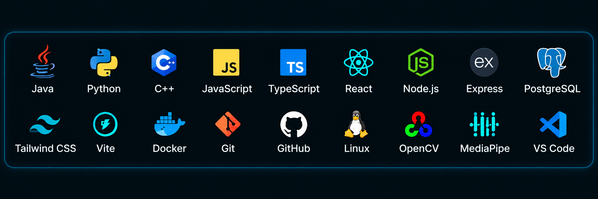

 

## 🚀 FEATURED PROJECTS

<table>
<tr>

<td width="25%" valign="top">

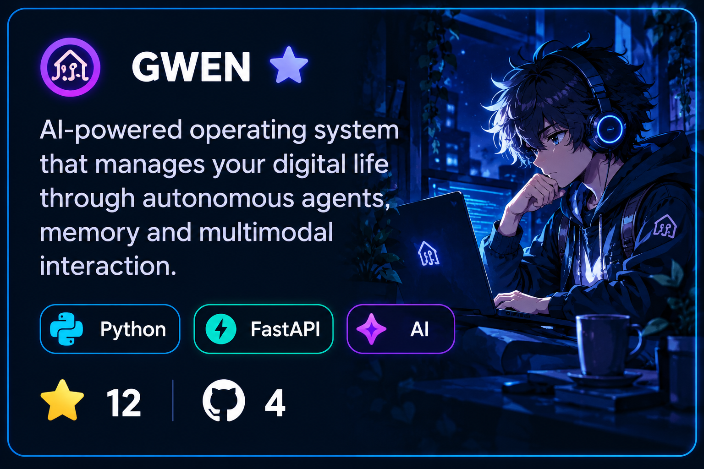

### 🤖 GWEN

AI-powered operating system / assistant focused on autonomous agents, multimodal interaction, and local AI.

**Python · FastAPI · AI**

</td>

<td width="25%" valign="top">

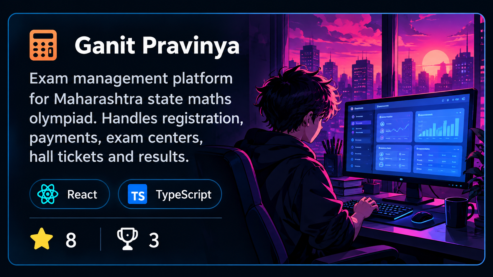

### 📐 Ganit Pravinya

Exam management platform for mathematics olympiad registration, students, payments, centers, hall tickets, and results.

**React · TypeScript · PostgreSQL**

</td>

<td width="25%" valign="top">

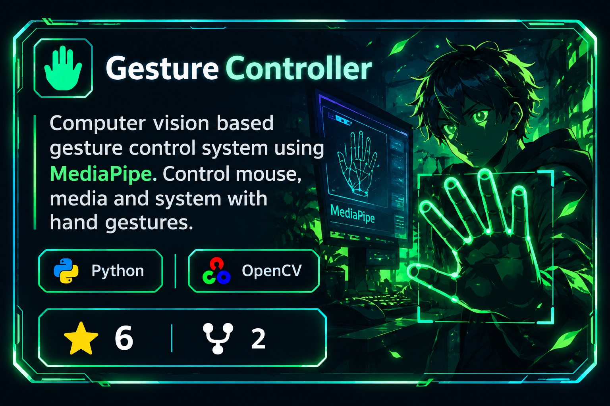

### 🖐️ Gesture Controller

Computer-vision based gesture controller using MediaPipe and OpenCV for mouse, media, and system interaction.

**Python · OpenCV · MediaPipe**

</td>

<td width="25%" valign="top">

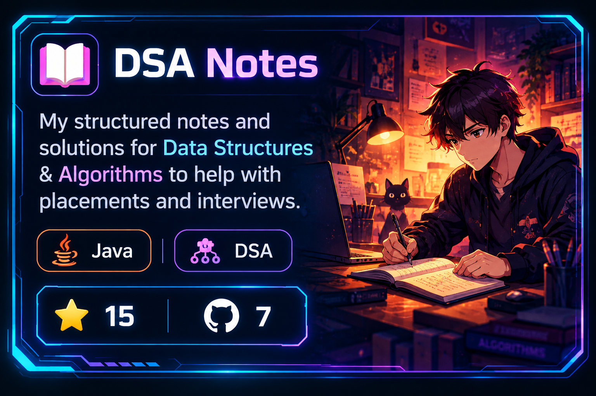

### 📚 DSA Notes

Structured notes and solutions for Data Structures & Algorithms, focused on learning, revision, placements, and interviews.

**Java · DSA**

</td>

</tr>
</table>

 

<table>
<tr>
<td width="34%" valign="top">

## 🏆 ACHIEVEMENTS

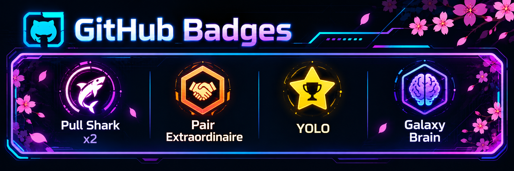

</td>

<td width="66%" valign="top">

## 📊 GITHUB STATS

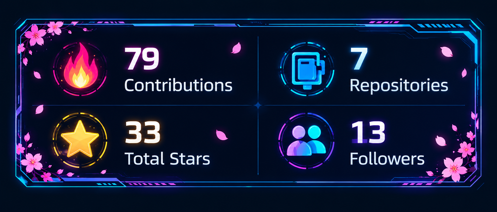

</td>
</tr>
</table>

 

## 📈 CONTRIBUTION JOURNEY

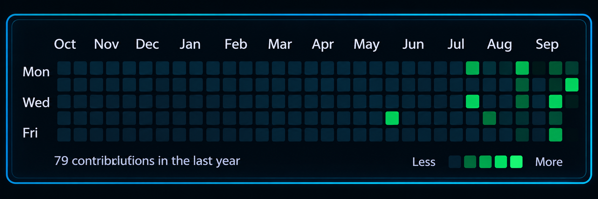

 

<table>
<tr>
<td width="50%" valign="top">

## 🐍 CONTRIBUTION QUEST

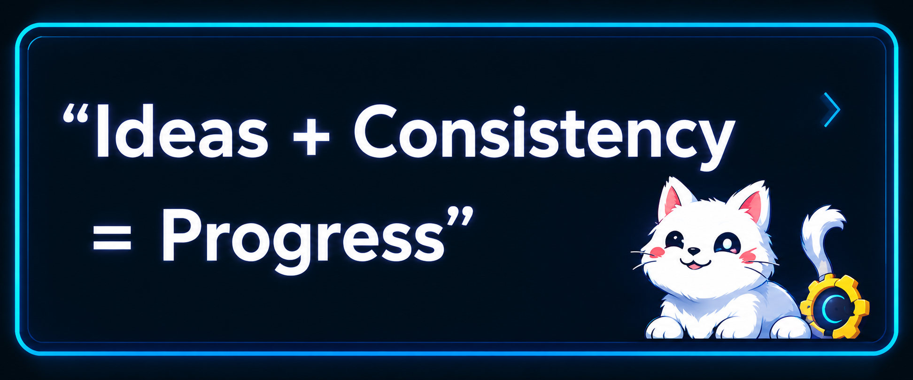

</td>

<td width="50%" valign="top">

## 📚 CURRENTLY LEARNING

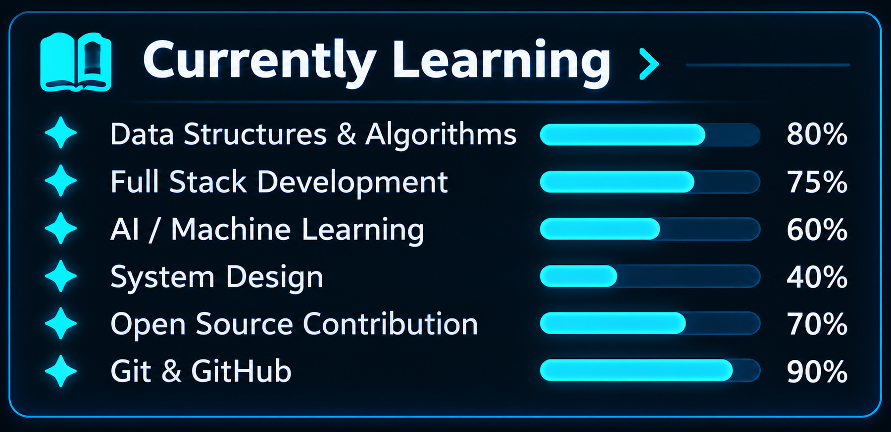

</td>
</tr>
</table>

 

## 🎮 NOW PLAYING

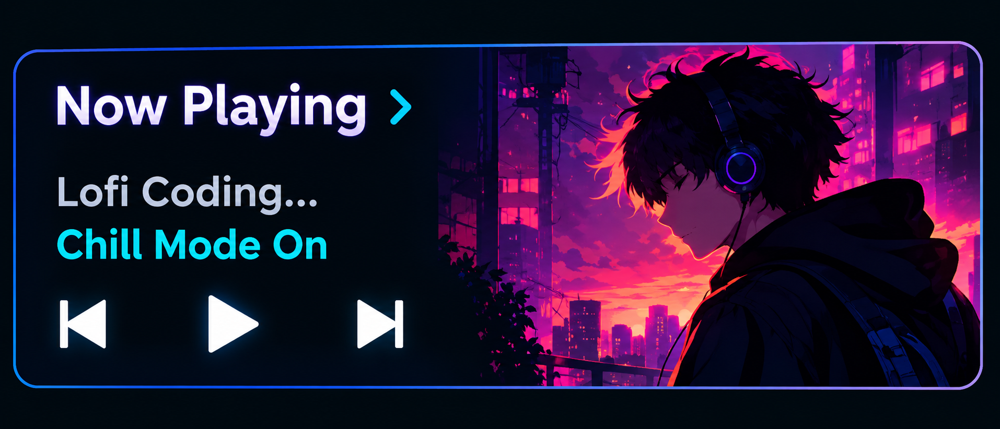

 

## 🔗 LET'S CONNECT

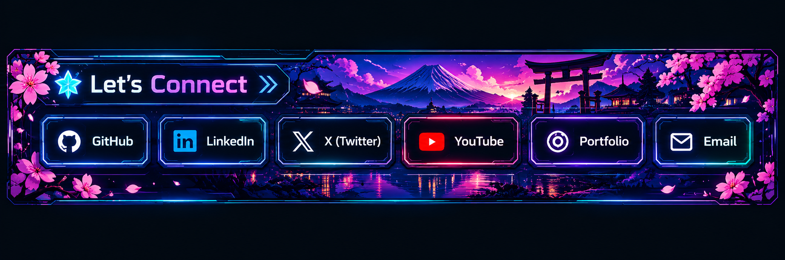

  

 

---

### 🌸 BUILD • LEARN • CREATE • CONTRIBUTE 🌸

**One step at a time. Consistency builds dreams.**

 

 

<!-- FINAL COMIC PANEL -->

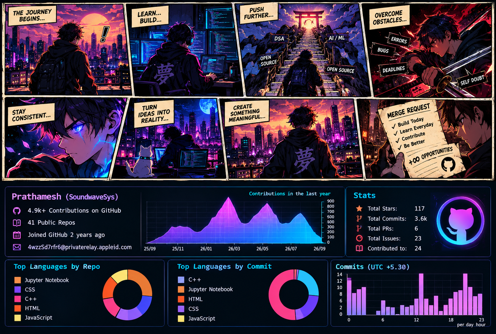

 

**Thanks for visiting my profile.**

⭐ Feel free to explore my repositories and follow my journey.

